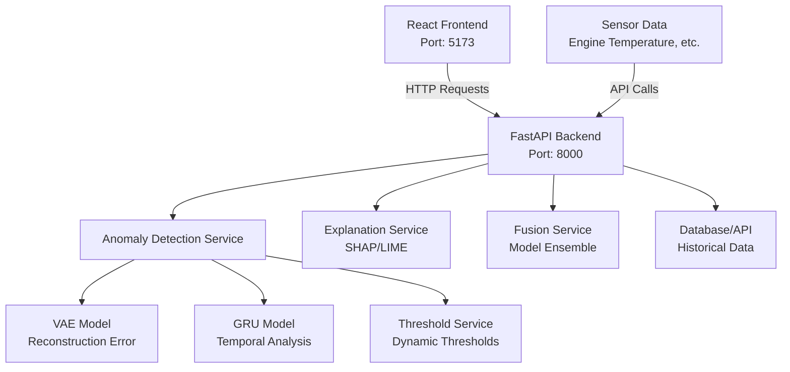

# Anomaly Detection Project

This is a full-stack anomaly detection application with a Python FastAPI backend and a React frontend.

## Project Structure

- `backend/` - Python FastAPI backend with anomaly detection models
- `frontend/` - React application with Vite

## Architecture Diagram



## Prerequisites

- Python 3.8+
- Node.js 16+
- npm or yarn

## Setup and Installation

### Backend Setup

1. Navigate to the backend directory:
   ```bash
   cd backend
   ```

2. Create a virtual environment (recommended):
   ```bash
   python -m venv venv
   source venv/bin/activate  # On Windows: venv\Scripts\activate
   ```

3. Install Python dependencies:
   ```bash
   pip install fastapi uvicorn pydantic numpy
   ```

### Frontend Setup

1. Navigate to the frontend directory:
   ```bash
   cd ../frontend
   ```

2. Install Node.js dependencies:
   ```bash
   npm install
   ```

## Running the Application

### Start the Backend

1. From the backend directory (with virtual environment activated):
   ```bash
   uvicorn app:app --reload --host 0.0.0.0 --port 8000
   ```

   The backend will be available at `http://localhost:8000`

### Start the Frontend

1. From the frontend directory:
   ```bash
   npm run dev
   ```

   The frontend will be available at `http://localhost:5173` (default Vite port)

## API Documentation

Once the backend is running, visit `http://localhost:8000/docs` for the FastAPI interactive documentation.

## Development

- Backend uses FastAPI for the API and includes anomaly detection services
- Frontend is built with React and Vite for fast development
- Models include VAE (Variational Autoencoder) and GRU for anomaly detection

## License

ISC
